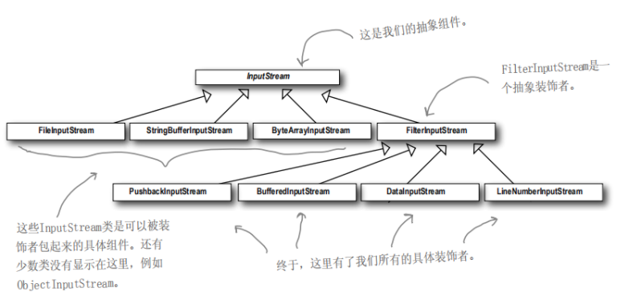
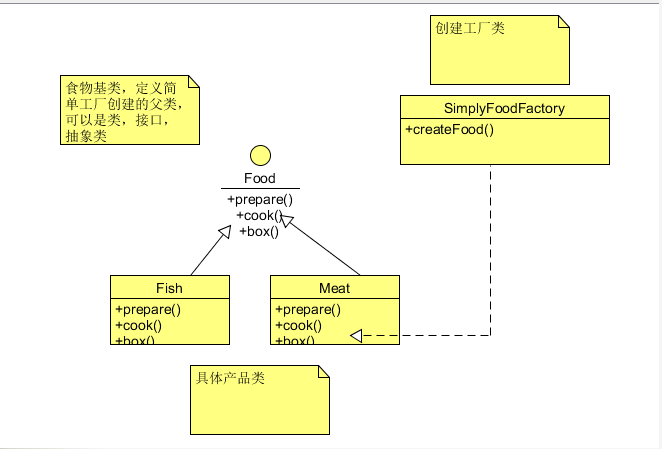
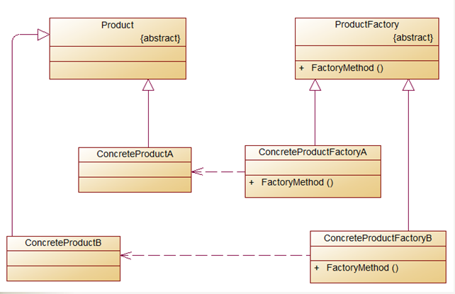
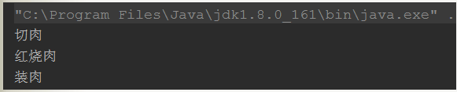
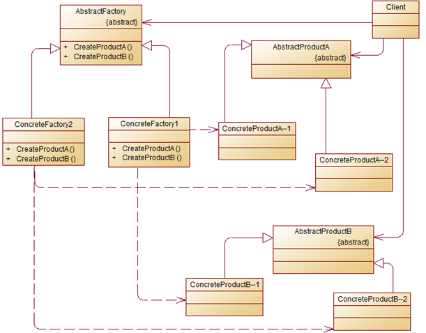
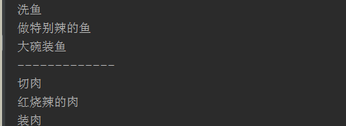
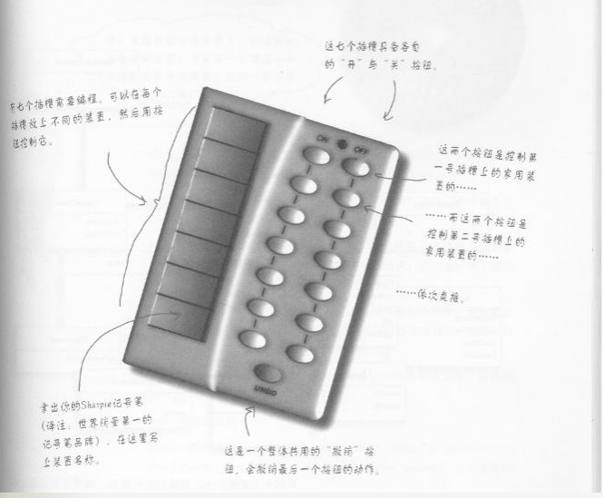
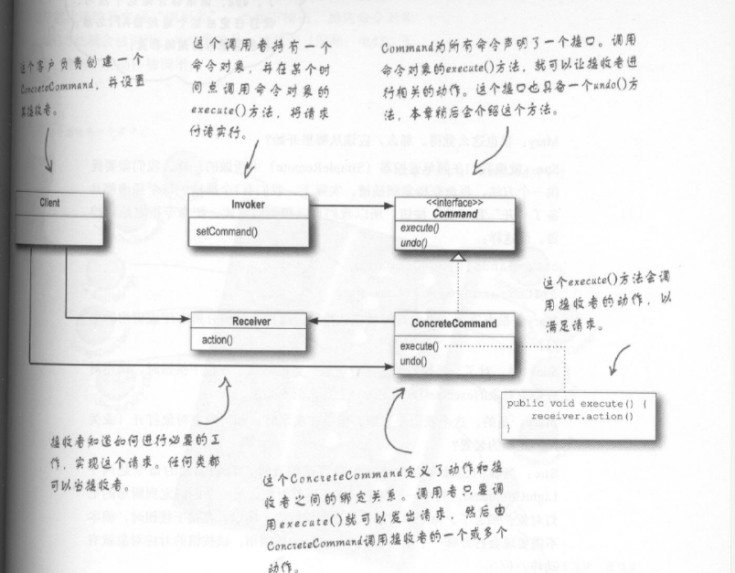

# 设计模式

设计模式是软件开发人员在软件开发过程中面临的一般问题的解决方案。这些解决方案是众多软件开发人员经过相当长的一段时间的试验和错误总结出来的。学习设计模式会帮助你更好的理解面向对象。

设计模式有多达23种，这些模式可以分为三大类：创建型模式（Creational Patterns）、结构型模式（Structural Patterns）、行为型模式（Behavioral Patterns）

学习设计模式主要是通过《Head First 设计模式》，并参照了一些其他教程。学习心得记录于此，帮助自己深入理解。

## 一、策略模式

### 1.1引言

开始第一个设计模式前，先看下设计模式的六大原则（之前面试曾被问过）   

**开闭原则（Open Close Principle）**

开闭原则的意思是：**对扩展开放，对修改关闭**。在程序需要进行拓展的时候，不能去修改原有的代码，实现一个热插拔的效果。简言之，是为了使程序的扩展性好，易于维护和升级。想要达到这样的效果，我们需要使用接口和抽象类，后面的具体设计中我们会提到这点。

**里氏代换原则（Liskov Substitution Principle）** 

里氏代换原则是面向对象设计的基本原则之一。 里氏代换原则中说，任何基类可以出现的地方，子类一定可以出现。LSP 是继承复用的基石，只有当派生类可以替换掉基类，且软件单位的功能不受到影响时，基类才能真正被复用，而派生类也能够在基类的基础上增加新的行为。里氏代换原则是对开闭原则的补充。实现开闭原则的关键步骤就是抽象化，而基类与子类的继承关系就是抽象化的具体实现，所以里氏代换原则是对实现抽象化的具体步骤的规范。

**依赖倒转原则（Dependence Inversion Principle）**

这个原则是开闭原则的基础，具体内容：针对接口编程，依赖于抽象而不依赖于具体。

**接口隔离原则（Interface Segregation Principle）**

这个原则的意思是：使用多个隔离的接口，比使用单个接口要好。它还有另外一个意思是：降低类之间的耦合度。由此可见，其实设计模式就是从大型软件架构出发、便于升级和维护的软件设计思想，它强调降低依赖，降低耦合。

**迪米特法则，又称最少知道原则（Demeter Principle）**

最少知道原则是指：一个实体应当尽量少地与其他实体之间发生相互作用，使得系统功能模块相对独立。

**合成复用原则（Composite Reuse Principle）**

合成复用原则是指：尽量使用合成/聚合的方式，而不是使用继承。

这些原则要多学习，多体验才能更深的理解

### 1.2策略模式

**定义：**定义了算法族，分别封装起来，让它们之间可以互相替换，此模式让算法的变化独立于使用算法的客户。

**意图：**定义一系列的算法,把它们一个个封装起来, 并且使它们可相互替换。

**主要解决：**在有多种算法相似的情况下，使用 if...else 所带来的复杂和难以维护。

**何时使用：**一个系统有许多许多类，而区分它们的只是他们直接的行为。

**如何解决：**将这些算法封装成一个一个的类，任意地替换。

**关键代码：**实现同一个接口。

### 1.3 实现

实例剖析：基类鸭子，鸭子有飞行及喊叫的行为，飞行和喊叫都可以分别封装成一个算法族，将算法接口放入鸭子基类中，那么在鸭子子类中可以自由选择行为。如果有新的飞行或者喊叫方式，则只需要增加一个飞行策略类继承飞行接口即可。 

#### **类图设计** 


#### 代码实现

鸭子基类 

```java
public abstract class Duck {
     //飞行接口
     Flybehavior flybehavior;
     //叫声接口
     QuackBehavior quackBehavior;
     public Duck(){

     }
     //叫声方法
     public void performquack(){
         quackBehavior.quack();
     }
     //飞行方法
     public void performFly(){
         flybehavior.fly();
     }
     public abstract void display();
     
     public void swim() {
        System.out.println("All ducks float, even decoys!");
     }
}
```

飞行接口及相关策略子类 

```java
//飞行接口
public interface Flybehavior {
    void fly();
}
//具体飞行算法（不会飞）
public class FlyNoWay implements Flybehavior {
    public void fly() {
        System.out.println("I can’t fly");
    }
}
//可以飞
public class FlyWithWings implements Flybehavior {
    public void fly() {
        System.out.println("I’m flying!!");
    }
}
```

喊叫接口及相关策略子类 

```java
//喊叫接口
public interface QuackBehavior {
    void quack();
}
//喊叫策略算法类
public class Quack implements QuackBehavior {
    public void quack() {
        System.out.println("Quack");
    }
}

public class MuteQuack implements QuackBehavior {
    public void quack() {
        System.out.println("<< Silence >>");
    }
}

public class Squeak implements QuackBehavior {
    public void quack() {
        System.out.println("Squeak");
    }
}
```

鸭子类 

```java
//鸭子子类
public class MallardDuck extends Duck {
    public MallardDuck(){
        quackBehavior=new Quack();
        flybehavior=new FlyWithWings();
    }
    public void display() {
        System.out.println("I’m a real Mallard duck");
    }
}
```

运行

```java
public static void main(String[] args) {
        Duck mallardDuck=new MallardDuck();
        mallardDuck.performFly();
        mallardDuck.performquack();
    }
```

运行结果 


### 1.4优缺点

**优点：** 1、策略类之间可以自由切换。由于策略类都实现同一个接口，所以使它们之间可以自由切换。 2、避免使用多重条件判断。 3、扩展性良好。有新的算法时，只需要新增一个策略类即可，不需要修改原有代码

**缺点：** 1、策略类会增多。 2、所有策略类都需要对外暴露。

**使用场景：** 1、如果在一个系统里面有许多类，它们之间的区别仅在于它们的行为，那么使用策略模式可以动态地让一个对象在许多行为中选择一种行为。 2、一个系统需要动态地在几种算法中选择一种。 3、如果一个对象有很多的行为，如果不用恰当的模式，这些行为就只好使用多重的条件选择语句来实现。

**注意事项：**如果一个系统的策略多于四个，就需要考虑使用混合模式，解决策略类膨胀的问题。

## 二、观察者模式

### 2.1 引言

什么是观察者模式呢？其实生活中很常见：报社出版报纸，并定期向订阅用户推送报纸，用户可以订阅报纸和取消订阅。这个例子中可以看出观察者模式的主体有两个，即：出版者+订阅者，我们改个名称：出版者改为“主题”，订阅者改为“观察者”。 

### 2.2 观察者模式

**定义：**定义了对象之间的一对多依赖，这样一来，当一个对象改变状态时，它的所有依赖者都会收到通知并自动更新

**意图：**定义对象间的一种一对多的依赖关系，当一个对象的状态发生改变时，所有依赖于它的对象都得到通知并被自动更新。

**主要解决：**一个对象状态改变给其他对象通知的问题，而且要考虑到易用和低耦合，保证高度的协作。

**何时使用：**一个对象（目标对象）的状态发生改变，所有的依赖对象（观察者对象）都将得到通知，进行广播通知。

**如何解决：**使用面向对象技术，可以将这种依赖关系弱化。

**关键代码：**在抽象类里有一个 ArrayList 存放观察者们。

### 2.3 实现

**实例剖析：**一个气象监测应用，气象监测系统定时会更新气象的相关数据，而对应有三种布告板都要显示此信息（显示的形式有所不同），一旦气象数据有所改动，三块布告板的数据也要同时的更新布告板中的显示信息。

**分析：**从需求中很容易看出：气象数据是主题，而三块布告板是观察者。要实现管理订阅者，则主题中必须存在一个数组列表用户管理。有一个方法进行数据推送更新，而订阅者的实现比较简单，他们继承统一的订阅接口，并且有一个更新数据方法。

#### **类图**设计


#### 代码实现

主题及观察者接口 

```java
// 观察者接口
public interface Observer {
    public void update(float temp, float humidity, float pressure);
}

//主题接口
public interface Subject {
    //注册观察者
    void registerObserver(Observer o);
    //移除观察者
    void removeObserver(Observer o);
    //通知观察者
    void notifyObservers();
}
//布告板接口
public interface DisplayElement {
    void display();
}
```

主题实现 

```java
//主题实现
public class WeatherData implements Subject {
    //订阅者列表
    private ArrayList observers;
    private float temperature;
    private float humidity;
    private float pressure;

    public WeatherData(){
        observers=new ArrayList();
    }
    //增加订阅者
    public void registerObserver(Observer o) {
        observers.add(o);
    }
    //移除订阅者
    public void removeObserver(Observer o) {
        int index=observers.indexOf(o);
        if(index>=0) {
            observers.remove(index);
        }
    }
    //通知订阅者
    public void notifyObservers() {
        for (int i = 0; i <observers.size() ; i++) {
            Observer observer = (Observer)observers.get(i);
            observer.update(temperature, humidity, pressure);
        }
    }

    public void measurementsChanged() {
        notifyObservers();
    }

    public void setMeasurements(float temperature, float humidity, float pressure) {
        this.temperature = temperature;
        this.humidity = humidity;
        this.pressure = pressure;
        measurementsChanged();
    }
}
```

观察者实现 

```java
public class CurrentConditionsDisplay implements DisplayElement,Observer {

    private float temperature;
    private float humidity;
    private Subject weatherData;

    public CurrentConditionsDisplay(Subject weatherData) {
        this.weatherData = weatherData;
        weatherData.registerObserver(this);
    }

    public void display() {
        System.out.println("第一种显示方式: " + temperature
                + "F degrees and " + humidity + "% humidity");
    }

    public void update(float temp, float humidity, float pressure) {
        this.temperature = temp;
        this.humidity = humidity;
        display();
    }
}
public class StatisticsDispxlay implements DisplayElement,Observer {
    private float temperature;
    private float pressure;
    private Subject weatherData;

    public StatisticsDispxlay(WeatherData weatherData){
        this.weatherData=weatherData;
    }

    public void display() {
        System.out.println("第二种显示方式: " + temperature
                + "F degrees and " + pressure + "% pressure");
    }

    public void update(float temp, float humidity, float pressure) {
        this.temperature=temp;
        this.pressure=pressure;
    }
}
public class ForecastDisplay implements DisplayElement,Observer {
    private  float humidity;
    private  float pressure;
    private WeatherData weatherData;

    public ForecastDisplay(WeatherData weatherData){
        this.weatherData=weatherData;
    }

    public void display() {
        System.out.println("第三种显示方式: " + humidity
                + "F degrees and " + pressure + "% pressure");
    }

    public void update(float temp, float humidity, float pressure) {
        this.humidity=humidity;
        this.pressure=pressure;
    }
}
```

运行

```java
private static void observer() {
        WeatherData weatherData = new WeatherData();

        CurrentConditionsDisplay currentDisplay =
                new CurrentConditionsDisplay(weatherData);
        StatisticsDispxlay statisticsDisplay = new StatisticsDispxlay(weatherData);
        ForecastDisplay forecastDisplay = new ForecastDisplay(weatherData);
        weatherData.setMeasurements(80, 65, 30.4f);
        weatherData.setMeasurements(82, 70, 29.2f);
        weatherData.setMeasurements(78, 90, 29.2f);
    }
```

运行结果


### 2.4 总结

观察者模式有以下几个优点：

- 观察者模式实现了表示层和数据逻辑层的分离，并定义了稳定的更新消息传递机制，并抽象了更新接口，使得可以有各种各样不同的表示层，即观察者。
- 观察者模式在被观察者和观察者之间建立了一个抽象的耦合，被观察者并不知道任何一个具体的观察者，只是保存着抽象观察者的列表，每个具体观察者都符合一个抽象观察者的接口。
- 观察者模式支持广播通信。被观察者会向所有的注册过的观察者发出通知。

观察者也存在以下一些缺点：

- 如果一个被观察者有很多直接和间接的观察者时，将所有的观察者都通知到会花费很多时间。
- 虽然观察者模式可以随时使观察者知道所观察的对象发送了变化，但是观察者模式没有相应的机制使观察者知道所观察的对象是怎样发生变化的。
- 如果在被观察者之间有循环依赖的话，被观察者会触发它们之间进行循环调用，导致系统崩溃，在使用观察者模式应特别注意这点。

**结语：**java中有内置的观察者模式，java.util包（package）内包含最基本的Observer接口与Observable类，这和我们的Subject接口与Observer接口很相似。里面还增加了状态的判断，这样可以让订阅者能够自主的拉取。

## 三、装饰者模式

### 3.1 引言

先看一个开发问题，很多人都玩过英雄联盟这款游戏：里面有各种英雄，每个英雄都有各自的技能（一般是4个主动技能），每升一级可以升级一个技能，但是可升级的技能不固定。我们需要通过技能状态来计算伤害，这个时候组合就非常多了（理论上是英雄数*技能数）。如果用继承来解决的话，那么子类就爆炸多了。

除了继承还有一种设计，就是在基类上增加布尔变量，如Q，E等，然后提供一些has(get)和set方法来设置这些布尔值，子类里通过扩展计算伤害值，这个看起来是一个可行的设计，但这个设计也会有一些问题。

1.每个技能可以多次加点，单纯靠布尔值是处理不了的。

2.技能有可能会进行调整，那么我们就必须通过修改基类来处理。

3.游戏里面还有装备这种情况，增加装备也是相当于多了技能（貌似用装备来做例子更合适）。。。

我们用更好的方法来解决这个问题

这个问题的本质是扩展，我们想要扩展一些功能，但是不想用继承。装饰者模式可以解决这个问题

### 3.2 装饰者模式

**定义：**动态地将责任附加到对象上。若要扩展功能，装饰者提供了比继承更有弹性的替代方案。

**意图：**动态地给一个对象添加一些额外的职责。就增加功能来说，装饰器模式相比生成子类更为灵活。

**主要解决：**一般的，我们为了扩展一个类经常使用继承方式实现，由于继承为类引入静态特征，并且随着扩展功能的增多，子类会很膨胀。

**何时使用：**在不想增加很多子类的情况下扩展类。

**如何解决：**将具体功能职责划分，同时继承装饰者模式。

通用类图


### 3.3 实现

英雄联盟游戏实现 

```java
//抽象基类
public abstract class Hero {
    //学习技能
    public abstract void learnSkills();
}

//具体英雄兰博，需要被扩展的类
public class Lanbo extends Hero {
    //英雄属性
    private String name;

    public Lanbo(String name){
        this.name = name;
    }
    @Override
    public void learnSkills() {
        System.out.println(name + "学习了以上技能！");
    }
}

//抽象技能类，装饰者的抽象基类
public abstract class Skills extends Hero {
    private Hero hero;

    public Skills(Hero hero){
        this.hero = hero;
    }

    @Override
    public void learnSkills() {
        if(hero!=null){
            hero.learnSkills();
        }
    }
}

//具体装饰子类，用来装饰 Q技能
public class Skill_Q extends Skills {
    private  String skillName;

    public Skill_Q(Hero hero,String skillName) {
        super(hero);
        this.skillName=skillName;
    }
    @Override
    public void learnSkills() {
        System.out.println("学习了技能Q:" +skillName);
        super.learnSkills();
    }
}
//具体装饰子类，用来装饰 W技能
public class Skill_W extends Skills {
    private  String skillName;

    public Skill_W(Hero hero,String skillName) {
        super(hero);
        this.skillName=skillName;
    }
    @Override
    public void learnSkills() {
        System.out.println("学习了技能W:" +skillName);
        super.learnSkills();
    }
}
//具体装饰子类，用来装饰E技能
public class Skill_E extends Skills {
    private  String skillName;
    public Skill_E(Hero hero,String skillName) {
        super(hero);
        this.skillName=skillName;
    }
    @Override
    public void learnSkills() {
        System.out.println("学习了技能E:" +skillName);
        super.learnSkills();
    }
}
//具体装饰子类，用来装饰R技能
public class Skill_R extends Skills {
    private  String skillName;

    public Skill_R(Hero hero,String skillName) {
        super(hero);
        this.skillName=skillName;
    }
    @Override
    public void learnSkills() {
        System.out.println("学习了技能R:" +skillName);
        super.learnSkills();
    }
}
```

运行

```java
        //选择英雄
        Hero hero = new Lanbo("兰博");
        Skills q = new Skill_Q(hero,"纵火盛宴");
        Skills w = new Skill_W(q,"破碎护盾");
        Skills e = new Skill_E(w,"电子鱼叉");
        Skills r = new Skill_R(e,"恒温灼烧");
        //学习技能
        r.learnSkills();
```

### 3.4 总结

**优点**

1. 装饰这模式和继承的目的都是扩展对象的功能，但装饰者模式比继承更灵活
2. 通过使用不同的具体装饰类以及这些类的排列组合，设计师可以创造出很多不同行为的组合
3. 装饰者模式有很好地可扩展性

**缺点**：装饰者模式会导致设计中出现许多小对象，如果过度使用，会让程序变的更复杂。并且更多的对象会是的差错变得困难，特别是这些对象看上去都很像。

java.io类就是用的装饰者模式



## 四、工厂模式

### 4.1 引言

园子里有关设计模式的文章可以说数不胜数，之前也看过很多，但是其实理解都不深入，时间一长就忘了。最好是记录下来，总结中加深印象，这里也给刚开始进行开发的同学提个建议，不要因为自己写的不好而不去写，谁都是从菜鸟开始的，不断的总结才能将知识消化成自己的。

现在开始今天的学习。

工厂模式是设计模式中很重要的一个模式，其中有简单工厂模式（并不能算一个模式），工厂模式，抽象工厂模式。

工厂模式，从名字可以看出，这是一个创建型的模式，是用来创建对象。我们从简单工厂模式开始

### 4.2 简单工厂模式

简单工厂模式其实并不是一个设计模式，反而比较像一种变成习惯。为什么会出现简单工厂呢？

当使用"new"关键字创建一个对象时，此时该类就依赖与这个对象，也就是他们之间的耦合度高，当需求变化时，我们就不得不去修改此类的源码。

当我们需要实例化一个类时，不知道实例化哪个类，那么我们把这个变化封装起来，用一个工厂来帮我们创建对象。

这里我想用饭店的例子，先看类图：



代码实现

```java
//食物接口
public interface Food {
    //准备
    void prepare();
    //烹饪
    void cook ();
    //打包
    void box();
}

//具体食物 鱼
public class Fish implements Food {
    public void prepare() {
        System.out.println("洗鱼");
    }
    public void cook() {
        System.out.println("水煮鱼");
    }
    public void box() {
        System.out.println("大碗装鱼");
    }
}

//具体食物类 肉
public class Meat implements Food {
    public void prepare() {
        System.out.println("切肉");
    }
    public void cook() {
        System.out.println("红烧肉");
    }
    public void box() {
        System.out.println("装肉");
    }
}
```

运行

```java
//简单工厂
public class SimpleFoodFactory {
    //静态创建工厂方法
    public static Food createFood(String type){
        if(!type.isEmpty())
       {
           switch (type){
               case "FISH":
                   return new Fish();
               case "MEAT":
                   return new Meat();
               default: return null;
           }
       }
       return null;
    }
}
```

运行结果


简单工厂模式很简单，也很容易理解。它带来了很多好处

1.解决了客户端直接依赖于具体对象的问题，客户端可以消除直接创建对象的责任，而仅仅是消费产品。简单工厂模式实现了对责任的分割

2.代码复用，其他的客户也可以用这个工厂来创建对象。

但是缺点也很明显，扩展困难，一旦添加新菜单，工厂方法必须修改。工厂模式为我们解决这个问题。

### 4.3 工厂模式

先看一个结构图： 



从这个图中可以看出，工厂方法中创建对象不再是在一个类中，每一个具体的产品类都有一个创建工厂，其唯一的职责就是创建对应的产品，这是两个平行类层级

给出定义：**定义了一个用于创建对象的接口，让子类来决定要实例化哪一个类，****工厂方法让类把实例化延迟到其子类。**

再改造下上面的例子

增加一个Creator接口，并创建两个制造工厂FishCreator 和 MeatCreator

```java
//工厂基类，创建食物基类
public interface Creator {
    Food CreateFoddFactory();
}

//创建鱼工厂
public class FishCreator implements Creator {
    public Food CreateFoddFactory() {
        return new Fish();
    }
}

//创建肉工厂
public class MeatCreator implements Creator {
    public Food CreateFoddFactory() {
        return new Meat();
    }
}
```

运行

```java
private static void factory() {
    //创建工厂
    Creator creator=new MeatCreator();
    //创建食物
    Food food = creator.CreateFoddFactory();
    if(food!=null){
        food.prepare();
        food.cook();
        food.box();
    }
}
```

结果



### 4.4 抽象工厂

工厂模式中一个工厂只创建一个产品，但是在现实的大厂中一般都是创建一系列产品，成为产品族，比如我们上面的例子，我们餐馆要开分店，然而每个地方的口味不一样，有些地方喜欢辣的，有些则喜欢不辣的，我们可以设计生产辣产品的工厂及不辣产品的工厂，那么这个时候就用到抽象工厂模式。

先看图：



再结合之前的代码，我们进行修改，先创建一个抽象食物工厂，再创建辣和不辣的工厂 

```java
//抽象工厂
public interface FoodFactory {
    //创建肉工厂
    Meat createMeat();
    //创建鱼工厂
    Fish createFish();
}

//制造辣的工厂
public class HotFoodFactory implements FoodFactory {
    public Meat createMeat() {
        return new HotMeat();
    }
    public Fish createFish() {
         return new HotFish();
    }
}

//不辣的的工厂
public class NotHotFoodFactory implements FoodFactory {
    public Meat createMeat() {
        return new NotHotMeat();
    }
    public Fish createFish() {
        return new NotHotFish();
    }
}
```

再增加辣的肉和不辣的肉 

```java
//辣的肉
public class HotMeat extends Meat {
    @Override
    public void cook() {
        System.out.println("红烧辣的肉");
    }
}

//不辣的肉
public class NotHotMeat extends Meat {
    @Override
    public void cook() {
        System.out.println("红烧不辣的肉");
    }
}

//辣的鱼
public class HotFish extends Fish {
    @Override
    public void cook() {
        System.out.println("做特别辣的鱼");
    }

}

//不辣的鱼
public class NotHotFish extends Fish {
    @Override
    public void cook() {
        System.out.println("做不辣的鱼");
    }

}
```

运行

```java
private static void abstractFactory() {
        //辣工厂创建辣产品
        FoodFactory hotFoodFactoryoodFactory=new HotFoodFactory();
        Fish hotfish = hotFoodFactoryoodFactory.createFish();
        if(hotfish!=null){
            hotfish.prepare();
            hotfish.cook();
            hotfish.box();
        }
        System.out.println("-------------");
        Meat hotMeat = hotFoodFactoryoodFactory.createMeat();
        if(hotMeat!=null){
            hotMeat.prepare();
            hotMeat.cook();
            hotMeat.box();
        }
    }
```

结果



抽象工厂模式将具体产品的创建延迟到具体工厂的子类中，这样将对象的创建封装起来，可以减少客户端与具体产品类之间的依赖，从而使系统耦合度低，这样更有利于后期的维护和扩展，这真是抽象工厂模式的优点所在，然后抽象模式同时也存在不足的地方。下面就具体看下抽象工厂的缺点（缺点其实在前面的介绍中以已经涉及了）：

**抽象工厂模式很难支持新种类产品的变化。这是因为抽象工厂接口中已经确定了可以被创建的产品集合，如果需要添加新产品，此时就必须去修改抽象工厂的接口，这样就涉及到抽象工厂类的以及所有子类的改变，这样也就违背了“开发——封闭”原则。**

知道了抽象工厂的优缺点之后，也就能很好地把握什么情况下考虑使用抽象工厂模式了，下面就具体看看使用抽象工厂模式的系统应该符合那几个前提：

- 一个系统不要求依赖产品类实例如何被创建、组合和表达的表达，这点也是所有工厂模式应用的前提。
- 这个系统有多个系列产品，而系统中只消费其中某一系列产品
- 系统要求提供一个产品类的库，所有产品以同样的接口出现，客户端不需要依赖具体实现。

 一口学完了工厂模式，休息休息！

## 五、单例模式

### 5.1 引言

单例模式应该是设计模式中比较简单的一个，因为这个模式只有一个类，但不要小看这个设计模式，这个模式可是面试的时候很常见的一个。

单例模式有什么的用处：有一些对象我们只需要一个的时候，比如线程池，缓存，注册表等。

也就是说这个模式的作用是：**保证只有一个实例对象**。

### 5.2 单例模式

先看定义**：确保一个类只有一个实例,并提供一个全局访问点。**

开始思考，我们如何确保只有一个实例？

首先要知道我们是如何创建的对象的，这个很容易回答：用**new**关键字，只要是公开类，我们在外部就可以无限的实例化，也是就说第一步就是要将类私有化。

如何私有化：**使用私有构造构造器，一旦使用私有构造器，那么外部便不能实例化。**

可一旦使用私有构造器，那么不是只有内部才能调用这个构造器么？既然外部不能实例化，那么如何去调用这个私有构造器呢？

这个时候静态方法就起作用了，我们定义一个静态方法，通过静态方法去调用私有构造器，问题就解决了。

通过上面的思考，代码就已经出来了：

```java
//单例模式实现-懒汉式
public class Singleton {

    //利用静态变量记录类的唯一实例
    private static Singleton  uniqueInstance;
    //把构造器设置为私有，只有内部才可以调用构造器
    private Singleton(){}
    //用静态方法实例化对象
    public static Singleton getInstance(){
        //如果为空则说明还没有创建实例，这个时候我们可以创建，这个就是延时实例化，也就是传说中的懒汉式
        if(uniqueInstance==null){
            uniqueInstance = new Singleton();
        }
        return uniqueInstance;
    }
    public void showMsg(){
        System.out.println("其他方法，显示数据");
    }
}
```

这种实现方法叫做**懒汉式，**但这种懒汉模式存在一个问题：**线程不安全**，在多线程情况下，完全有可能生成多个实例，这个时候可以用**synchronized**关键字来处理。 

```java
public static synchronized Singleton getInstance(){
 ...
}
```

当然，加锁会降低一些性能,其实还有一种方法，那就是**饿汉式**：

```java
//单例模式-饿汉式
public class Singleton1 {
    //初始化器重直接创建，可以保证线程安全
    private static Singleton1 uniqueInstance=new Singleton1();
    //静态方法
    private Singleton1(){}
    //直接返回
    public static Singleton1 getInstance(){
        return uniqueInstance;
    }
}
```

这样的方式容易产生垃圾对象，浪费一些内存，但是没有加锁，效率提高很多（一般情况下推荐使用这种方式）。

另外还有一种凡是：**双重检查加锁**

```java
//双重加锁方式
public class Singleton2 {
    //利用volatile 关键字保证多个线程正确使用uniqueInstance
    private volatile  static Singleton2 uniqueInstance;
    private Singleton2(){}

    public static Singleton2 getInstance(){
        //检查实例，不存在则进入同步代码块
        if(uniqueInstance==null){
            //同步代码块
            synchronized (Singleton2.class){
                //进入代码块后，再判断一次
                if(uniqueInstance==null){
                    uniqueInstance=new Singleton2();
                }
            }
        }
        return uniqueInstance;
    }
}
```

这种方式可以大大提高性能，就是实现有些复杂（且不支持1.4之前的版本） 

### 5.3 总结

单例模式是一个相对简单的模式，主要的核心在私有化构造器，及暴露一个静态方法创建实例，再考虑多线程相关情况。 

## 六、命令模式

### 6.1 引言

先看需求：设计一个家电遥控器系统，每个家电由开、关两个按钮控制， 每个家电都由各自的厂商提供了实现方法，我们只需要调用这些方法即可，如图所示： 



如何实现这个功能呢？

第一步我们要排除的实现方式就是if条件判断，因为一旦增加家电，我们就必须修改代码，这不符合我们的设计思路。

然后我们想想，遥控按钮只是发出一个请求，具体的实现是通过各自厂商的API，我们应该让遥控器（动作的请求者）从厂商的API（动作的执行者）中解耦出来。可是怎么去解耦呢？毕竟按钮动作和家电行为是息息相关的。

这个时候就可以使用**命令模式，**来认识一下命令模式。

### 6.2 命令模式

先看定义：**命令模式是把一个操作或者行为抽象为一个对象中，通过对命令的抽象化来使得发出命令的责任和执行命令的责任分隔开。命令模式的实现可以提供命令的撤销和恢复功能**

听着还是很抽象，我们再举一个例子，《破产姐妹》中熟悉的场景 ，顾客到餐厅点单，服务员MAX拿了订单，放在订单柜台，厨师Oleg根据订单准备餐点。

分析下其中的过程，把订单想象成一个用来请求准备餐点的对象，订单对象可以被传递，服务员MAX负责传递对象，订单的接口中只包含一个orderUp()方法，这个方法封装了而准备餐点所需的动作，订单内有一个“需要进行准备工作的对象”（也就是厨师Oleg）的引用，这一切都封装起来，MAX甚至不需要知道订单上有什么，她只负责传递。

有没有清楚一些，转成类图：



类图中可以看出，其中的几个角色：

- 客户角色(Client)：发出一个具体的命令并设置其接受者。

- 调用者（Invoker）：持有一个命令对象，负责命令对象执行命令。

- 命令角色（Command）：声明命令接口，并具备一个让接收者执行的方法。

- 具体命令角色（ConreteCommand）:定义了动作和接收者之间的绑定关系，负责调用接收者的方法。

- 接受者（Receiver）：负责具体动作的执行。

  

  ### 6.3 代码实现

```java
//命令接口
public interface Command {
    //命令方法
    void execute();
}
//命令接收者(Receiver),电灯
public class Light {
    private String name;
    public Light(String name){
       this.name=name;
    }
    //开灯操作
    public void on(){
        System.out.println(name+":开灯！");
    }
    //关灯操作
    public void off(){
        System.out.println(name+"：关灯");
    }
}

//绑定命令与接收者关系ConreteCommand
public class LightOnCommand implements Command {
    Light light;
    public LightOnCommand(Light light){
        this.light=light;
    }
    //具体命令方法
    public void execute() {
       light.on();
    }
}

//命令模式的客户（Invoker）
public class SimpleRemoteControl {
    //命令接口
    Command solt;
    public void setCommand(Command command){
        this.solt=command;
    }
    //命令方法
    public void buttonWasPressed(){
        solt.execute();
    }

}
```

运行

```java
private static void simpleControl() {
        //遥控器调用者
        SimpleRemoteControl control=new SimpleRemoteControl();
        //电灯
        Light light=new Light("客厅");
        //具体命令类
        LightOnCommand lightOnCommand=new LightOnCommand(light);
        //设置命令
        control.setCommand(lightOnCommand);
        //命令方法
        control.buttonWasPressed();


    }
```

结果


这里其实只实现了其中一个按钮，让我们来补充一些代码

增加多一个接收者：

```java
//另外一个接受者吊灯
public class CeilingFan {
    private String name;

    public CeilingFan(String name){
        this.name=name;
    }

    public void on(){
        System.out.println(name+":打开");
    }

    public void off(){
        System.out.println(name+":关闭");
    }
}
//吊灯的开灯命令
public class CeilingFanOffCommand implements Command {
    CeilingFan ceilingFan;
    public CeilingFanOffCommand(CeilingFan ceilingFan){
        this.ceilingFan=ceilingFan;
    }
    //具体命令方法
    public void execute() {
        ceilingFan.off();
    }
}

//吊灯的关灯命令
public class CeilingFanOnCommand implements Command {
    CeilingFan ceilingFan;
    public CeilingFanOnCommand(CeilingFan ceilingFan){
        this.ceilingFan = ceilingFan;
    }
    //具体命令方法
    public void execute() {
        ceilingFan.on();
    }
}

//遥控调用
public class RemoteControl {
    //申明命令数组
    Command[] onCommands;
    Command[] offCommands;
    public RemoteControl(){
        onCommands=new Command[4];
        offCommands=new Command[4];
    }
    //设置命令
    public void setCommand(int solt,Command onCommand,Command offCommand){
        onCommands[solt]=onCommand;
        offCommands[solt]=offCommand;
    }
    //打开按钮
    public void onButtonWasPressed(int solt){
         onCommands[solt].execute();
    }
    //关闭按钮
    public void offButtonWasPressed(int solt){
        offCommands[solt].execute();
    }

}

private static void control() {
        RemoteControl remoteControl=new RemoteControl();
        Light roomLight=new Light("客厅灯");
        Light kitchLight=new Light("厨房灯");
        CeilingFan roomCeilingFan=new CeilingFan("客厅吊扇");
        CeilingFan kitchCeilingFan=new CeilingFan("厨房吊扇");
        //电灯相关命令
        LightOnCommand roomLightOnCommand=new LightOnCommand(roomLight);
        LightOnCommand kitchLightOnCommand=new LightOnCommand(kitchLight);
        LightOffCommand roomLightOffCommand=new LightOffCommand(roomLight);
        LightOffCommand kitchLightOffCommand=new LightOffCommand(kitchLight);
        //吊扇相关命令
        CeilingFanOnCommand roomCeilingFanOnCommand =new CeilingFanOnCommand(roomCeilingFan);
        CeilingFanOnCommand kitchCeilingFanOnCommand =new CeilingFanOnCommand(kitchCeilingFan);
        CeilingFanOffCommand roomCeilingFanOffCommand =new CeilingFanOffCommand(roomCeilingFan);
        CeilingFanOffCommand kitchCeilingFanOffCommand =new CeilingFanOffCommand(kitchCeilingFan);
        //将命令加载到卡槽中
        remoteControl.setCommand(0,roomLightOnCommand,roomLightOffCommand);
        remoteControl.setCommand(1,kitchLightOnCommand,kitchLightOffCommand);
        remoteControl.setCommand(2,roomCeilingFanOnCommand,roomCeilingFanOffCommand);
        remoteControl.setCommand(3,kitchCeilingFanOnCommand,kitchCeilingFanOffCommand);
        //使用遥控
        remoteControl.onButtonWasPressed(0);
        remoteControl.offButtonWasPressed(0);
        remoteControl.onButtonWasPressed(1);
        remoteControl.offButtonWasPressed(1);
        remoteControl.onButtonWasPressed(2);
        remoteControl.offButtonWasPressed(2);
        remoteControl.onButtonWasPressed(3);
        remoteControl.offButtonWasPressed(3);
    }
```

运行结果：


### 6.4 总结

在下面的情况下可以考虑使用命令模式：

1. 系统需要支持命令的撤销（undo）。命令对象可以把状态存储起来，等到客户端需要撤销命令所产生的效果时，可以调用undo方法吧命令所产生的效果撤销掉。命令对象还可以提供redo方法，以供客户端在需要时，再重新实现命令效果。
2. 系统需要在不同的时间指定请求、将请求排队。一个命令对象和原先的请求发出者可以有不同的生命周期。意思为：原来请求的发出者可能已经不存在了，而命令对象本身可能仍是活动的。这时命令的接受者可以在本地，也可以在网络的另一个地址。命令对象可以串行地传送到接受者上去。
3. 如果一个系统要将系统中所有的数据消息更新到日志里，以便在系统崩溃时，可以根据日志里读回所有数据的更新命令，重新调用方法来一条一条地执行这些命令，从而恢复系统在崩溃前所做的数据更新。
4. 系统需要使用命令模式作为“CallBack(回调)”在面向对象系统中的替代。Callback即是先将一个方法注册上，然后再以后调用该方法。

**优点：** 1、降低了系统耦合度。 2、新的命令可以很容易添加到系统中去。

**缺点：**使用命令模式可能会导致某些系统有过多的具体命令类。

## 七、适配器模式

### 7.1引言

最近懒劲又上来了，隔了几天没有学习，最近的博文阅读量也比较少，不过还是希望自己坚持下去，相信水滴石穿，量变总会引起质变的。

今天要学习的是适配器模式，顾名思义，适配器模式是将两个不兼容的接口进行适配，类似转换器的功能。

先看一个例子，我们一个播放器，它有一个播放功能（继承一个播放接口，只有一个播放方法），最开始的时候它只支持播放MP3功能，现随着播放源的增多，我们想让它支持播放更多的文件类型。有一个厂商提供了其他的播放接口，但是其中的方法并不是叫做播放方法，这个时候我们必须把新厂商的接口转换成开始继承的播放接口，也就是把现在厂商的接口伪装成最先继承的播放接口，让它能够适配原先的方法

实际目的是让将一个接口转换成客户想要的另一个接口，适配器模式使得原本由于接口不兼容而不能一起工作的那些类可以一起工作。

### 7.2 适配器模式

**定义：**适配器模式把一个类的接口变换成客户端所期待的另一种接口，从而使原本因接口不匹配而无法在一起工作的两个类能够在一起工作。

**意图：**将一个类的接口转换成客户希望的另外一个接口。适配器模式使得原本由于接口不兼容而不能一起工作的那些类可以一起工作。

**主要解决：**主要解决在软件系统中，常常要将一些"现存的对象"放到新的环境中，而新环境要求的接口是现对象不能满足的。

**何时使用：** 1、系统需要使用现有的类，而此类的接口不符合系统的需要。 2、想要建立一个可以重复使用的类，用于与一些彼此之间没有太大关联的一些类，包括一些可能在将来引进的类一起工作，这些源类不一定有一致的接口。 3、通过接口转换，将一个类插入另一个类系中。（比如老虎和飞禽，现在多了一个飞虎，在不增加实体的需求下，增加一个适配器，在里面包容一个虎对象，实现飞的接口。）

**如何解决：**继承或依赖

**类图：**


### 7.3 代码实现

```java
//原先的播放器接口
public interface MediaPlayer {
    void play(String audioType, String fileName);
}

//新的高级播放器接口
public interface AdvancedMediaPlayer {
    void playVlc(String fileName);
    void playMp4(String fileName);
}

//继承高级播放接口的MP4播放器
public class Mp4Player implements AdvancedMediaPlayer {
    @Override
    public void playVlc(String fileName) {
    }

    @Override
    public void playMp4(String fileName) {
        System.out.println("Playing mp4 file. Name: "+ fileName);
    }
}

//继承高级播放接口的VlC播放器
public class VlcPlayer implements AdvancedMediaPlayer {
    @Override
    public void playVlc(String fileName) {
        System.out.println("Playing vlc file. Name: "+ fileName);
    }

    @Override
    public void playMp4(String fileName) {

    }
}

//适配器类
public class MediaAdapter implements MediaPlayer {
    MediaAdapter mediaAdapter; 
    AdvancedMediaPlayer advancedMediaPlayer;

    public MediaAdapter(String audioType){
        if(audioType.equalsIgnoreCase("vlc")){
            advancedMediaPlayer=new VlcPlayer();
        }else{
            advancedMediaPlayer=new Mp4Player();
        }
    }

    @Override
    //将现在的接口方法转换成原先接口的方法
    public void play(String audioType, String fileName) {
        if(audioType.equalsIgnoreCase("vlc")){
            advancedMediaPlayer.playVlc(fileName);
        }else{
            advancedMediaPlayer.playMp4(fileName);
        }
    }
}
//播放器
public class AudioPlayer implements MediaPlayer  {
    MediaAdapter mediaAdapter;
    @Override
    public void play(String audioType, String fileName) {
        //播放 mp3 音乐文件的内置支持
        if(audioType.equalsIgnoreCase("mp3")){
            System.out.println("Playing mp3 file. Name: "+ fileName);
        }
        //mediaAdapter 提供了播放其他文件格式的支持
        else if(audioType.equalsIgnoreCase("vlc")
                || audioType.equalsIgnoreCase("mp4")){
            mediaAdapter = new MediaAdapter(audioType);
            mediaAdapter.play(audioType, fileName);
        }
        else{
            System.out.println("Invalid media. "+
                    audioType + " format not supported");
        }
    }
}
//实现
private static void adapter() {
        AudioPlayer audioPlayer = new AudioPlayer();
        audioPlayer.play("mp3", "beyond the horizon.mp3");
        audioPlayer.play("mp4", "alone.mp4");
        audioPlayer.play("vlc", "far far away.vlc");
        audioPlayer.play("avi", "mind me.avi");
    }
```

结果：


### 7.4 总结

**优点：** 1、可以让任何两个没有关联的类一起运行。 2、提高了类的复用。 3、增加了类的透明度。 4、灵活性好。

**缺点：** 1、过多地使用适配器，会让系统非常零乱，不易整体进行把握。比如，明明看到调用的是 A 接口，其实内部被适配成了 B 接口的实现，一个系统如果太多出现这种情况，无异于一场灾难。因此如果不是很有必要，可以不使用适配器，而是直接对系统进行重构。 2.由于 JAVA 至多继承一个类，所以至多只能适配一个适配者类，而且目标类必须是抽象类。

**使用场景：**有动机地修改一个正常运行的系统的接口，这时应该考虑使用适配器模式。

**注意事项：**适配器不是在详细设计时添加的，而是解决正在服役的项目的问题。